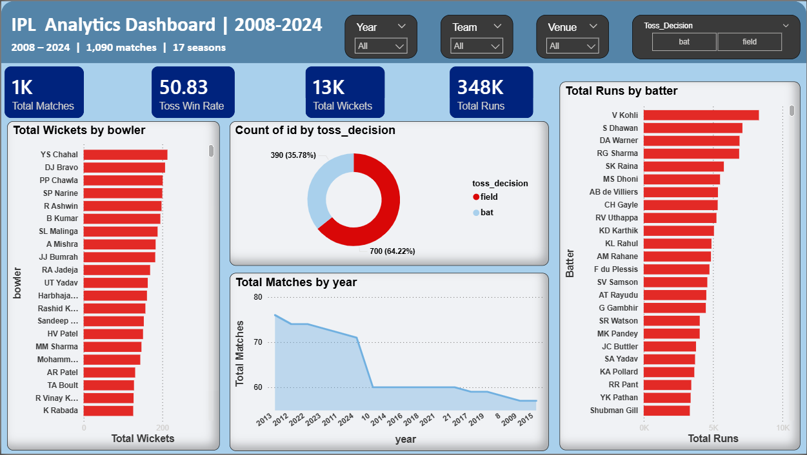

# IPL Data Analysis Dashboard (2008 - 2024)

## 📌 Project Overview
This project provides a comprehensive analysis of the Indian Premier League (IPL) from its inception in 2008 up to the 2024 season. Using Power BI, I transformed raw match and delivery data into an interactive dashboard to uncover trends in team performance, player statistics, and match outcomes.

## 📊 Key Features & Insights
* **Performance Metrics:** Analysis of match wins, toss decisions, and venue-based winning percentages.
* **Player Analysis:** Tracking top run-scorers (Orange Cap) and wicket-takers (Purple Cap) across seasons.
* **Toss Impact:** Visualizing whether winning the toss significantly influences the match result.
* **Dynamic Filtering:** Users can filter data by **Season**, **Team**, and **Venue** to get specific insights.

## 🛠️ Tech Stack
* **Tool:** Power BI Desktop
* **Data Cleaning:** Power Query (Transforming `matches.csv` and `deliveries.csv`)
* **Data Source:** IPL Dataset (Kaggle)
* **Languages:** DAX (Data Analysis Expressions) for custom measures

## 📁 Repository Structure
* `IPL_Dashboard.pbix`: The main Power BI project file.
* `data/`: Contains the datasets used:
    * `matches_clean.csv`: Cleaned match-level data (2008-2024).
    * `deliveries.csv`: Ball-by-ball performance data.
* `IPL_Dashboard.png`: A high-resolution screenshot of the final dashboard.
  
* ## 🐍 Python Data Processing
Before building the Power BI dashboard, I used Python for Data Cleaning and Exploratory Data Analysis (EDA):
* **Library:** Pandas, NumPy
* **Tasks:** Handled missing values in `city` and `player_of_match`, and formatted dates for the 2008-2024 timeline.
* **Script:** [View Cleaning Script](./notebooks/data_cleaning.ipynb)

## 🚀 How to View the Project
1.  **Download the .pbix file:** Clone this repository or download `IPL_Dashboard.pbix`.
2.  **Open in Power BI:** You will need [Power BI Desktop](https://powerbi.microsoft.com/desktop/) installed to interact with the dashboard.
3.  **Explore:** Use the slicers on the left/top to filter by your favorite team or a specific year.

---
**Author:** Ratnesh Amar Patil  
**Role:** Data Analyst / MCA Student
